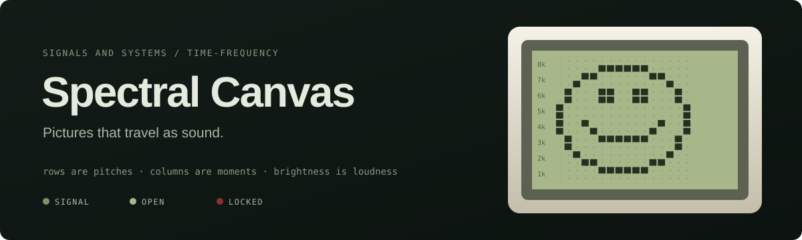
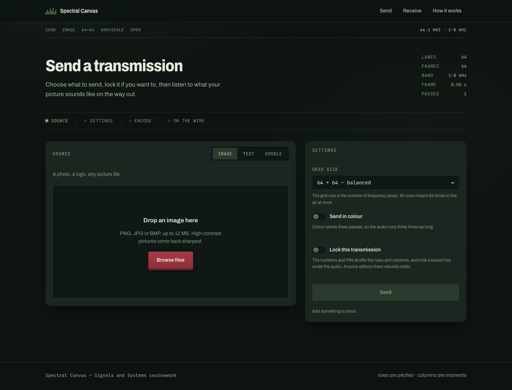
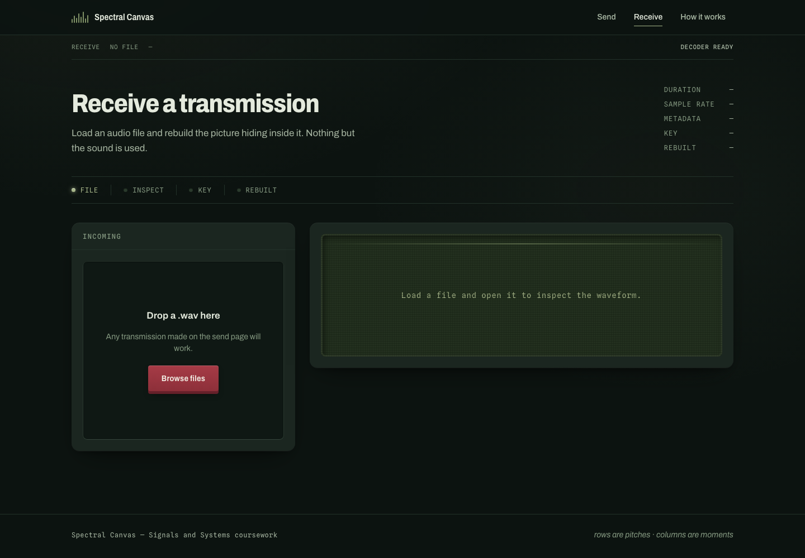
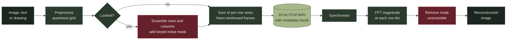
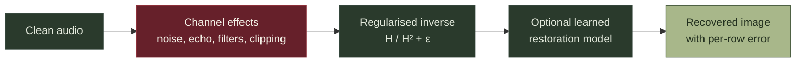

<p align="center">
  
</p>

<p align="center">
  <strong>Encoding and recovering images through audio spectrograms.</strong><br />
  A Signals and Systems coursework project.
</p>

---

## Contents

1. [Overview](#overview)
2. [Interface](#interface)
3. [How It Works](#how-it-works)
4. [Features](#features)
5. [System Requirements](#system-requirements)
6. [Installation](#installation)
7. [Running the Application](#running-the-application)
8. [Verifying the Installation](#verifying-the-installation)
9. [Using the Application](#using-the-application)
10. [Project Structure](#project-structure)
11. [Production Build](#production-build)
12. [Troubleshooting](#troubleshooting)

---

## Overview

Spectral Canvas converts an image into audio and reconstructs the image from that audio alone. Each row of the image is assigned its own frequency, each column becomes a short slice of time, and the brightness of a pixel sets the loudness of its tone. The result is a standard, playable WAV file. The receiver measures the strength of every frequency in every time slice and rebuilds the picture.

A transmission may optionally be locked with two 11-digit phone numbers and a 4 to 8 digit PIN. A wrong PIN does not raise an error: the transmission decodes to static. This is intended behaviour, and the interface explains it.

| Mapping | Image | Audio |
|---|---|---|
| Vertical axis | Row | Frequency lane (1 to 8 kHz) |
| Horizontal axis | Column | Time frame (0.05 s each) |
| Value | Brightness | Amplitude of the tone |

---

## Interface

<p align="center">
  
</p>

<table>
  <tr>
    <td width="50%"></td>
    <td width="50%"></td>
  </tr>
  <tr>
    <td align="center"><sub>Send: choose an image, text or drawing, then encode it</sub></td>
    <td align="center"><sub>Receive: upload a WAV file and rebuild the picture</sub></td>
  </tr>
</table>

---

## How It Works

### Encoding and decoding



The WAV file carries its own decoding metadata in a custom `SpCv` RIFF chunk, so the receiver can rebuild the picture from a single uploaded file without any other information.

### The two delivery tracks

| | Track 1: `wav` | Track 2: `call` |
|---|---|---|
| Scheme | Parallel multitone | 16-FSK, one tone per 40 ms symbol |
| Sample rate | 44.1 kHz | 8 kHz |
| Band | 1 to 8 kHz | 700 to 3200 Hz |
| Pixel is stored in | The amplitude of a tone | Which tone is playing |
| Intended channel | A file or a clean audio link | A GSM voice call |
| Error correction | None | Hamming(7,4), interleaved |

Voice codecs preserve which frequencies are present but not how loud they are. Track 1 therefore does not survive a phone call, and Track 2 was designed for exactly that channel.

### The channel bench



Because one image row is one frequency, the pattern of damaged rows identifies the channel: a low-pass filter damages the top rows, a high-pass filter the bottom rows, and a band-stop filter a contiguous band.

---

## Features

- Image, text and freehand drawing sources, in grayscale or colour.
- Optional locking with phone numbers and a PIN, using row and column permutation and a keyed noise mask.
- Waveform display and in-browser playback of the generated audio.
- A Call page that sends a picture over a simulated or real GSM voice call.
- An Experiments page that applies channel effects, attempts to undo them, and measures the cost.
- Two optional neural restoration models: an upscaler for call transmissions and a restorer for channel damage.

---

## System Requirements

### Required

| Software | Version | Purpose |
|---|---|---|
| [Git](https://git-scm.com/downloads) | Any recent version | Downloading the source code |
| [Python](https://www.python.org/downloads/) | 3.14 recommended | Backend server and signal processing |
| [Node.js](https://nodejs.org/) | 18 or later (LTS recommended) | Frontend development server |

The Python dependencies are pinned to versions tested on Python 3.14.5. Using the same minor version avoids installation problems.

### Optional

These are needed only for the Call page. The rest of the application runs without them.

| Software | Purpose | macOS | Linux (Debian/Ubuntu) | Windows |
|---|---|---|---|---|
| ffmpeg | Reading phone recordings (`.mka`, `.m4a`, `.caf`) | `brew install ffmpeg` | `sudo apt install ffmpeg` | `winget install Gyan.FFmpeg` |
| libgsm | GSM 06.10 codec for the simulated call | `brew install libgsm` | `sudo apt install libgsm-tools` | Included in most ffmpeg builds |
| pjsua | Placing a real SIP call | `brew install pjproject` | Build pjproject from source | Not available; use a virtual audio cable instead |

---

## Installation

### Step 1: Download the source code

Using Git:

```bash
git clone https://github.com/Utshav-saha/Spectral-Canvas.git
cd Spectral-Canvas
```

Alternatively, open the [repository page](https://github.com/Utshav-saha/Spectral-Canvas), select **Code**, then **Download ZIP**, and extract the archive. Open a terminal in the extracted folder.

### Step 2: Set up the backend

All backend commands are run from inside the `backend` folder.

**macOS and Linux**

```bash
cd backend
python3 -m venv .venv
source .venv/bin/activate
pip install --upgrade pip
pip install -r requirements.txt
```

**Windows (PowerShell)**

```powershell
cd backend
python -m venv .venv
.venv\Scripts\Activate.ps1
python -m pip install --upgrade pip
pip install -r requirements.txt
```

If PowerShell refuses to run the activation script, run the following once and then try again:

```powershell
Set-ExecutionPolicy -Scope CurrentUser RemoteSigned
```

The requirements include PyTorch, which is a large download. On Linux without a GPU, a much smaller CPU-only build can be installed first:

```bash
pip install torch --index-url https://download.pytorch.org/whl/cpu
pip install -r requirements.txt
```

PyTorch is only used by the two restoration models. If it is removed from `requirements.txt`, every other part of the application continues to work.

### Step 3: Set up the frontend

Open a second terminal in the project root:

```bash
cd frontend
npm install
```

### Step 4 (optional): Check the Call page dependencies

With the backend virtual environment active:

```bash
cd backend
python -m voip.cli check-env
```

This reports which optional tools are installed and what is missing.

---

## Running the Application

The backend and frontend run as two separate processes. Start the backend first.

**Terminal 1: backend**

```bash
cd backend
source .venv/bin/activate        # Windows: .venv\Scripts\Activate.ps1
uvicorn app.main:app --reload --port 8000
```

**Terminal 2: frontend**

```bash
cd frontend
npm run dev
```

Open <http://localhost:5173> in a browser.

| Address | Description |
|---|---|
| <http://localhost:5173> | The application |
| <http://127.0.0.1:8000/api/health> | Backend health check |
| <http://127.0.0.1:8000/docs> | Interactive API documentation |

The frontend development server forwards every `/api` request to port 8000, so no host address is hardcoded. If the backend port is changed, update `frontend/vite.config.js` to match.

---

## Verifying the Installation

From the `backend` folder, with the virtual environment active:

```bash
# Round-trip test: five encode and decode paths through the real WAV container
python -m tests.test_roundtrip

# Full test suite (tests that need libgsm, ffmpeg or PyTorch skip cleanly)
python -m pytest tests/ -q

# Text codec self-test
python spectral/text/text_codec.py
```

The round-trip test encodes grayscale open, grayscale locked, colour open, colour locked and rendered text. Every path should report a mean pixel error of `0.000`.

---

## Using the Application

### Sending and receiving a locked transmission

1. Open **Send**, choose **Doodle**, draw a shape and save the drawing.
2. Enable **Lock this transmission** and enter two 11-digit phone numbers and a PIN.
3. Select **Send**. Select the `output.wav` card to view its waveform, and press play to listen.
4. Select **Download audio**.
5. Open **Receive** and upload the downloaded file. The page reports that the transmission is locked.
6. Enter the same phone numbers and PIN, then select **Unlock and rebuild**.

Entering a wrong PIN first is instructive. The image rebuilds as static, because the scramble is reversed with the wrong permutation.

### Other pages

| Page | Route | Purpose |
|---|---|---|
| Landing | `/` | Introduction, with an interactive miniature of the pipeline |
| Send | `/simulate` | Encode an image, text or drawing to audio |
| Receive | `/receive` | Decode an uploaded WAV file |
| Call | `/call` | Send a picture over a simulated or real voice call |
| Experiments | `/experiments` | Apply channel effects and measure recovery |

---

## Project Structure

```
Spectral-Canvas/
├── backend/
│   ├── app/                FastAPI application: routes, services, session store
│   ├── spectral/           Signal processing library (no web dependencies)
│   │   ├── input/          Image, text and drawing preprocessing
│   │   ├── encoder/        Parallel multitone audio encoder
│   │   ├── decoder/        Synchronisation, STFT decoding, reconstruction
│   │   ├── common/         WAV container and security (locking)
│   │   ├── analysis/       Waveform and spectrogram analysis
│   │   ├── channel/        Channel effects and their inverses
│   │   ├── restore/        Neural restoration models
│   │   ├── text/           Text MFSK codec
│   │   └── tel/            Telephony path: FSK modem and call simulator
│   ├── voip/               Real SIP calls and recording handling
│   ├── tools/              Model checkpoints and dataset tools
│   ├── tests/              Test suite
│   └── requirements.txt
├── frontend/
│   ├── src/
│   │   ├── pages/          Landing, Send, Receive, Call, Experiments
│   │   ├── components/     Shared interface components
│   │   ├── api/            HTTP clients
│   │   └── styles/         Design tokens
│   └── package.json
├── assets/                 README images
├── DESIGN.md               Visual design system
└── README.md
```

---

## Production Build

```bash
cd frontend
npm run build        # outputs to frontend/dist
npm run preview      # serves the build locally
```

To serve the built frontend from FastAPI directly, add the following to `backend/app/main.py`:

```python
from fastapi.staticfiles import StaticFiles
app.mount("/", StaticFiles(directory="../frontend/dist", html=True), name="site")
```

This mount must be placed **after** `include_router`; otherwise it will intercept requests to `/api`.

Run the backend with a single worker. Sessions are held in memory and are not shared between processes.

---

## Troubleshooting

| Problem | Resolution |
|---|---|
| `ModuleNotFoundError: No module named 'app'` | Start `uvicorn` from inside the `backend` folder. |
| `ModuleNotFoundError: No module named 'fastapi'` | The virtual environment is not active. Activate `backend/.venv` and retry. |
| `pip install` fails on a pinned version | Use Python 3.14, which the pinned versions were tested against. |
| The frontend loads but every request fails | The backend is not running on port 8000. Start it first. |
| The Call page reports missing dependencies | Run `python -m voip.cli check-env` and install the listed tools. |
| The model buttons are disabled | PyTorch is not installed. Install it with `pip install torch`. |
| A locked file decodes to static | The phone numbers or PIN do not match those used to lock it. |
